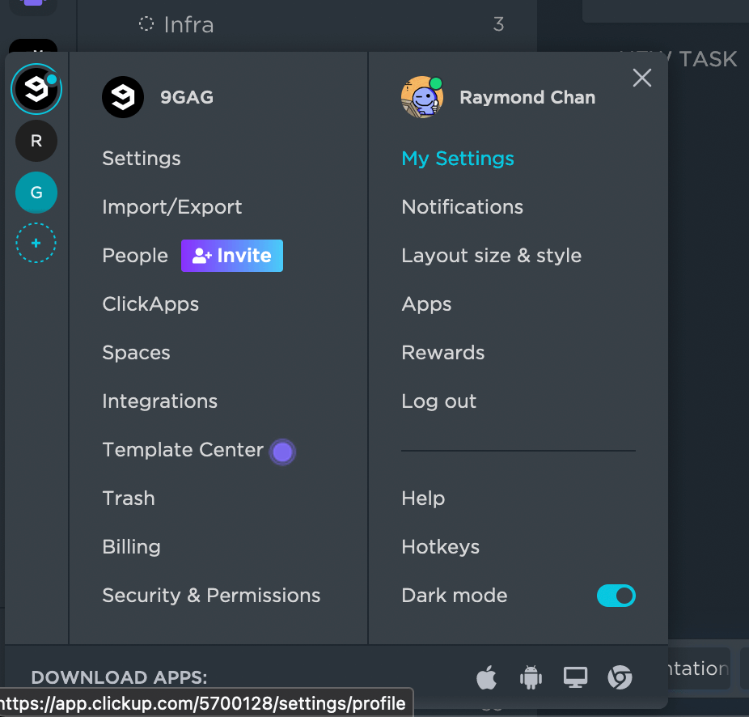

# About

This is a ClickUp extension designed for Chrome and Firefox

## Features

1. A handy "Create new issue" button in ClickUp task. Click to create a new issue in Github with format: `#{clickup_task_id} - {ClickUp issue name}`. After task creation, a new comment with Github link will be added to Clickup. 

2. Allowing batch select backlinked tasks and add comments in batch. (TBD)

## Installation guide

Clone this repository to your directory

### Chrome

1. Check [this guide](https://youtu.be/eM42mK9ZEPk)

### Firefox

1. Go to `about:config`, click "Accept the Risk and Continue"
2. Search for `xpinstall.signatures.required` and set to `false`
3. Install `web-ext` command ([Guide](https://extensionworkshop.com/documentation/develop/getting-started-with-web-ext/))

    ```shell
    npm install --global web-ext
    ```

4. Go to this repository and execute `web-ext build`, a zip artifact should be created under `web-ext-artifacts/`
5. Go to `about:addons` in Firefox, drag this zip file to install, you may see some warning, acknowledge it.

## Setup

Addon setup steps

### Chrome

1. Go to `chrome://extensions`
2. Click on "Details"
3. Scroll down to find "Extension options" 

Then, you will need to setup the followings in the preference page.

1. ClickUp API key  
2. Github API key -> follow these steps. Obtaining only `repo` permission should be enough for now 
3. Github username
4. Your default working repository
5. Click save -> Done!


### Firefox

1. Go to `about:addons`
2. Select "Preferences" 


